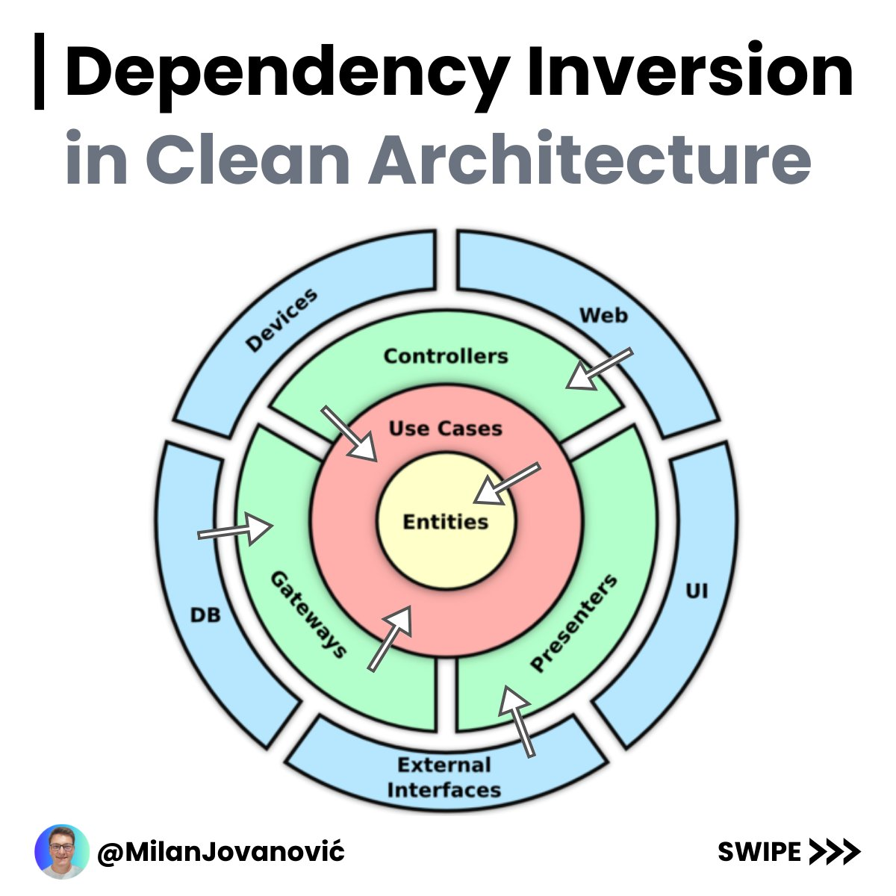

# 🏗️ Clean Architecture Overview

## Layers and Components

### 📦 Entities
- **Definition**: Business objects or model classes.

### ⚙️ Use Cases
- **Role**: Modifiers for business objects.
- ✨ Each use case represents a single action that the user can perform.
- 🧠 Contains application business logic.

### 🌐 Interface
- Serves as the connection between the outside world and the use cases (e.g., controllers, interfaces).

### 🔄 Adapter Layer
- Facilitates the interaction between external systems and internal layers.

### 🌍 External
- Defines the interfaces the system uses to communicate with the outside world.
- 📡 Includes interfaces and external communication layers.

---

## 📜 Core Principles

### 🔗 Dependency Rule
- Inner layers are independent of outer layers.

### 🛠️ Use of Interfaces
- Ensures that components can be replaced without causing dependency issues.

### ✂️ Separation of Concerns
- Different components focus on distinct responsibilities.

### 🏛️ Domain Model
- Represents the core business logic.

### ✅ Testing
- Designed for easy integration and comprehensive testing.

---

## 📝 Final Summary

### Layers

1. **🗃️ Domain**:  
   - Contains models that represent business entities.

2. **🔧 Application**:  
   - Includes services, `IService`, and `IRepository` interfaces.

3. **💾 Infrastructure**:  
   - Implements repositories and includes `DBContext`.

4. **🌐 Web**:  
   - Houses controllers.

### Additional Features
- **💡 Dependency Injection**: Promotes modularity and testability.
